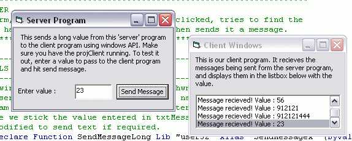



## Sending Unique Messages From one VB App To Another

### Description

Demonstrates how to communicate between your applications

by sending your own windows messages along with your

own variable. Properly commented code. I couldn't find a

similar program on PSC, so I thought I'd write this up.

Hope someone finds this useful.

The code includes 2 projects, 'a client' and a 'server'.

Using the RegisterWindowMessage API the server creates

a unique windows message, then through the FindWindow

API it checks to see if the 'client' is running. If it

is, it sends a message using SendMessageLong. The client

is subclassed and adds any messages it detects to a listbox.

The code is well commented, full explaining subclassing,

the API's it uses and why, so even a notice should be

able to understand all this.
 
### More Info
 

             |
---                |---
**Submitted On**   |2003-01-22 12:44:04
**By**             |[Nick Jones](https://github.com/Planet-Source-Code/PSCIndex/blob/master/ByAuthor/nick-jones.md)
**Level**          |Beginner
**User Rating**    |4.8 (48 globes from 10 users)
**Compatibility**  |VB 4\.0 \(32\-bit\), VB 5\.0, VB 6\.0
**Category**       |[Miscellaneous](https://github.com/Planet-Source-Code/PSCIndex/blob/master/ByCategory/miscellaneous__1-1.md)
**World**          |[Visual Basic](https://github.com/Planet-Source-Code/PSCIndex/blob/master/ByWorld/visual-basic.md)
**Archive File**   |[Sending\_Un1533181222003\.zip](https://github.com/Planet-Source-Code/nick-jones-sending-unique-messages-from-one-vb-app-to-another__1-42641/archive/master.zip)

